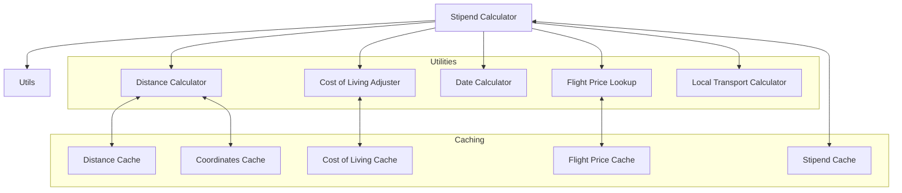
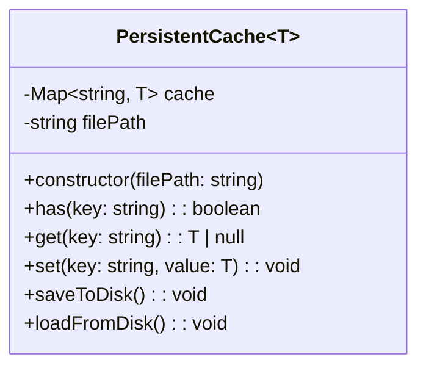
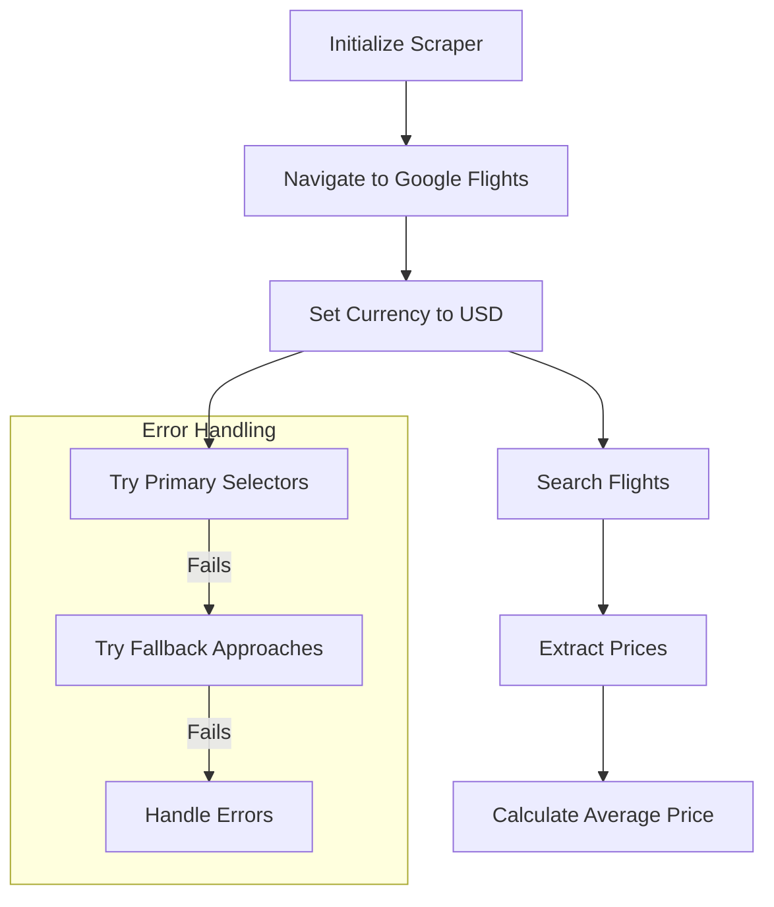
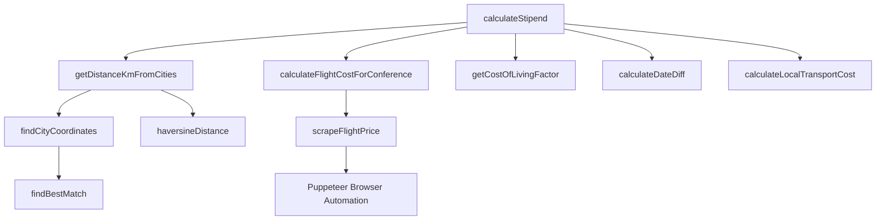

# System Patterns: Travel Stipend Calculator

## Architecture Overview

The system uses different entry points (CLI, Web UI via Proxy) to trigger calculations, primarily executed within a GitHub Actions environment. The core calculation logic remains modular.

**High-Level Flow (UI Trigger):**

```mermaid
graph LR
    UI[Web UI (ui/)] -- POST Request (Trip Details) --> Proxy[Proxy Function (api/trigger-workflow.ts @ Deno Deploy)];
    Proxy -- GitHub API Call (workflow_dispatch) --> GH_API[GitHub API];
    GH_API -- Triggers Workflow --> Actions[GitHub Actions Runner (batch-travel-stipend.yml)];
    Actions -- Runs Calculator --> Calculator[Core Calculator (src/travel-stipend-calculator.ts)];
    Calculator -- Uses --> DB[(SQLite DB)];
    Calculator -- Uses --> Cache[(JSON Caches)];
    Calculator -- Uses --> Scraper[Flight Scraper];
    Actions -- Saves Results --> Artifacts[GitHub Artifacts];
    Actions -- POST Results --> Proxy_Callback[Proxy Function (/api/workflow-complete)];
    Proxy_Callback -- WebSocket Push --> UI;

    subgraph "Calculation Core (Runs in GitHub Actions)"
        Calculator
        DB
        Cache
        Scraper
    end

    subgraph "Deployment"
        Proxy
    end
```

**Core Calculation Components:**



## Key Design Patterns

### 1. Functional Core, Imperative Shell

- **Core Calculation Logic**: Pure functions that transform input data into output data without side effects.
- **Imperative Shell**: Handles I/O operations, file reading/writing, and command-line interactions.

### 2. Data Persistence Strategy

The application uses multiple methods for data persistence:

- **SQLite Database (`db/travel-stipend.db`):** Stores reference data like cost-of-living indices, city coordinates, and taxi fares. Populated initially from `fixtures/*.csv`.
- **JSON Caching (`fixtures/cache/*.json`):** Implements persistent caching for calculated values (stipends, flight prices, distances) to optimize performance and avoid redundant computations/scraping.
    - **Cache Classes**: Implemented as generic classes (`PersistentCache`) that can store any type of data.
    - **Disk Persistence**: Caches are saved to JSON files for reuse between runs.
    - **Hash-Based Keys**: Cache entries use hash keys generated from input parameters to ensure uniqueness.



### 3. Data Transformation Pipeline

The application processes data through a series of transformations, primarily within the GitHub Actions workflow:

1. **Input Acquisition**: Receives trip parameters via CLI arguments, `workflow_dispatch` inputs (from UI/Proxy), or reads from `.github/test-events.json`.
2. **Matrix Generation**: The `setup` job in the workflow generates a matrix of calculation jobs based on the inputs.
3. **Calculation**: Each `calculate` job runs the core `calculateStipend` function, fetching necessary data from the SQLite DB and JSON caches, and performing flight scraping.
4. **Calculation**: Core stipend calculations are performed.
5. **Formatting**: Results are formatted for output.

### 4. Fallback Strategy

The system implements fallback mechanisms for resilience:

- **Web Scraping → Zero Cost**: When Google Flights scraping fails (either throws an error or returns a null price), the `travel-stipend-calculator.ts` now catches the error or null result and sets the `flightCost` to `0`. **Note:** The previously documented distance-based fallback is currently **not** implemented in the main calculation path.
- **Exact City Match → Fuzzy Matching**: When exact city matches fail, the system uses fuzzy matching with similarity thresholds.

### 5. Configuration Constants

The application uses a centralized constants file for configuration:

- **Base Rates**: Standard rates for lodging, meals, and transportation.
- **Adjustment Factors**: Multipliers for weekends, business districts, etc.
- **Default Values**: Fallback values when data is missing.

### 6. Web Scraping Strategy

The Google Flights scraper implements a multi-approach strategy for web element selection:

- **Primary Selectors**: First attempt uses specific CSS selectors.
- **Fallback Approaches**: If primary selectors fail, tries alternative approaches.
- **Error Recovery**: Implements error handling and recovery mechanisms.



## Component Relationships

### Core Calculator

The `calculateStipend` function is the central component that orchestrates the calculation process:



### Data Flow (UI Trigger Example)

```mermaid
graph LR
    A[UI: User enters trip details] --> B(Proxy: Receives POST /api/trigger-workflow);
    B --> C{Proxy: Authenticates via GitHub App};
    C --> D[Proxy: Calls GitHub API workflow_dispatch];
    D --> E(GitHub Actions: Workflow starts);
    E --> F{Actions: Setup job generates matrix};
    F --> G[Actions: Calculate job(s) run];
    G -- Reads --> H[(SQLite DB)];
    G -- Reads/Writes --> I[(JSON Caches)];
    G -- Calls --> J[Flight Scraper];
    G --> K[Actions: Saves result JSON];
    K --> L(Actions: Uploads artifact);
    G --> M{Actions: Consolidate job runs};
    M -- Downloads --> L;
    M --> N[Actions: Generates consolidated report];
    N --> O(Actions: Uploads report artifact);
    N --> P[Actions: POSTs result to Proxy /api/workflow-complete];
    P --> Q{Proxy: Finds WebSocket client};
    Q --> R[UI: Receives result via WebSocket];
    R --> S[UI: Displays results table];

```

## Error Handling Strategy

The application implements a robust error handling approach:

1. **Try-Catch Blocks**:
    - The main calculation loop likely wraps individual conference processing (needs verification in CLI/batch processing code).
    - The `calculateFlightCostForConference` function now uses a `try...catch` block specifically for the `scrapeFlightPrice` call.
2. **Graceful Degradation**:
    - **Flight Scraping:** On failure, the flight cost defaults to `0` instead of halting the calculation. The source is marked as "Scraping failed" or "Scraping returned null".
    - **City Matching:** Falls back to fuzzy matching if exact match fails.
3. **Error Logging**: Errors during flight scraping are logged to `console.error`. Other errors are logged with context.
4. **Multi-level Fallbacks**: The system primarily relies on the flight scraping fallback to `0` and the city matching fallback. The distance-based flight cost fallback is not currently active in the main calculation flow.

## Extension Points

The system is designed with several extension points:

1. **New Cost Factors**: Additional cost factors can be added to the stipend calculation.
2. **Alternative Data Sources**: The system can be extended to use different data sources for flights, coordinates, or cost of living.
3. **Output Formats**: New output formats can be added beyond CSV and console table.
4. **Sorting Options**: The command-line interface supports adding new sorting options.
5. **Scraper Enhancements**: The web scraper can be extended with new selection strategies and UI interaction patterns.
