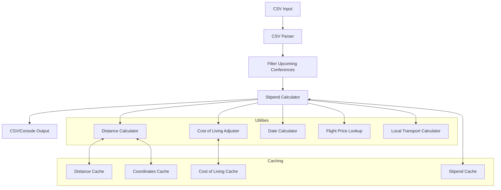
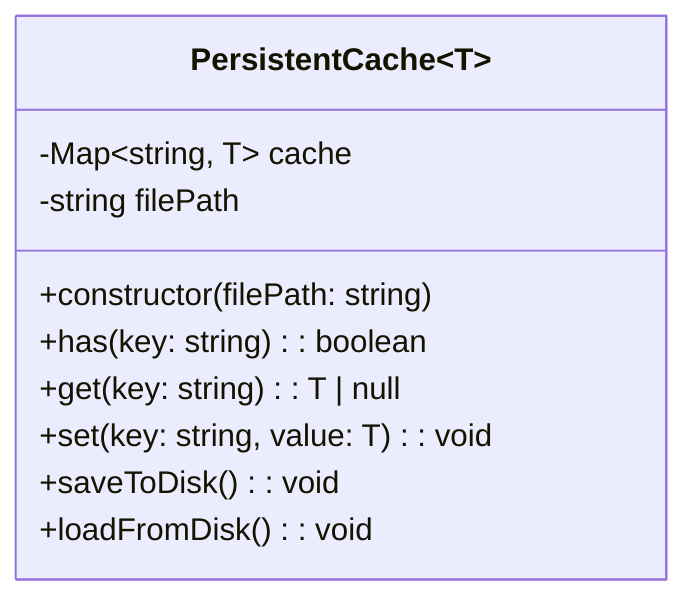
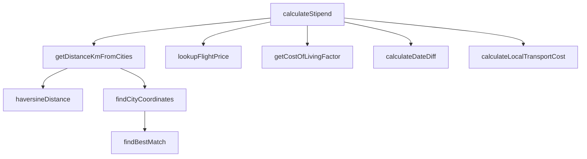
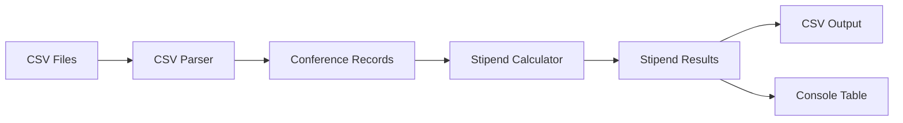

# System Patterns: Travel Stipend Calculator

## Architecture Overview

The Travel Stipend Calculator follows a modular, functional architecture with clear separation of concerns. The system is organized around core calculation functions that process input data through a pipeline of transformations.

## Key Design Patterns

### 1. Functional Core, Imperative Shell

- **Core Calculation Logic**: Pure functions that transform input data into output data without side effects.
- **Imperative Shell**: Handles I/O operations, file reading/writing, and command-line interactions.

### 2. Caching Strategy

The application implements a persistent caching system to optimize performance:

- **Cache Classes**: Implemented as generic classes that can store any type of data.
- **Disk Persistence**: Caches are saved to JSON files for reuse between runs.
- **Hash-Based Keys**: Cache entries use hash keys generated from input parameters to ensure uniqueness.

### 3. Data Transformation Pipeline

The application processes data through a series of transformations:

1. **Input Parsing**: CSV data is parsed into structured objects.
2. **Filtering**: Past conferences are filtered out.
3. **Enrichment**: Basic data is enriched with calculated fields.
4. **Calculation**: Core stipend calculations are performed.
5. **Formatting**: Results are formatted for output.

### 4. Fallback Strategy

The system implements fallback mechanisms for resilience:

- **API Flight Lookup → Distance-Based Calculation**: When API flight lookup fails, the system falls back to distance-based calculations.
- **Exact City Match → Fuzzy Matching**: When exact city matches fail, the system uses fuzzy matching with similarity thresholds.

### 5. Configuration Constants

The application uses a centralized constants file for configuration:

- **Base Rates**: Standard rates for lodging, meals, and transportation.
- **Adjustment Factors**: Multipliers for weekends, business districts, etc.
- **Default Values**: Fallback values when data is missing.

## Component Relationships

### Core Calculator

The `calculateStipend` function is the central component that orchestrates the calculation process:

### Data Flow

## Error Handling Strategy

The application implements a robust error handling approach:

1. **Try-Catch Blocks**: Individual conference processing is wrapped in try-catch to prevent one failure from affecting others.
2. **Graceful Degradation**: When components fail (e.g., API lookup), the system falls back to alternative methods.
3. **Error Logging**: Errors are logged to the console with context about which conference caused the issue.

## Extension Points

The system is designed with several extension points:

1. **New Cost Factors**: Additional cost factors can be added to the stipend calculation.
2. **Alternative Data Sources**: The system can be extended to use different data sources for flights, coordinates, or cost of living.
3. **Output Formats**: New output formats can be added beyond CSV and console table.
4. **Sorting Options**: The command-line interface supports adding new sorting options.
